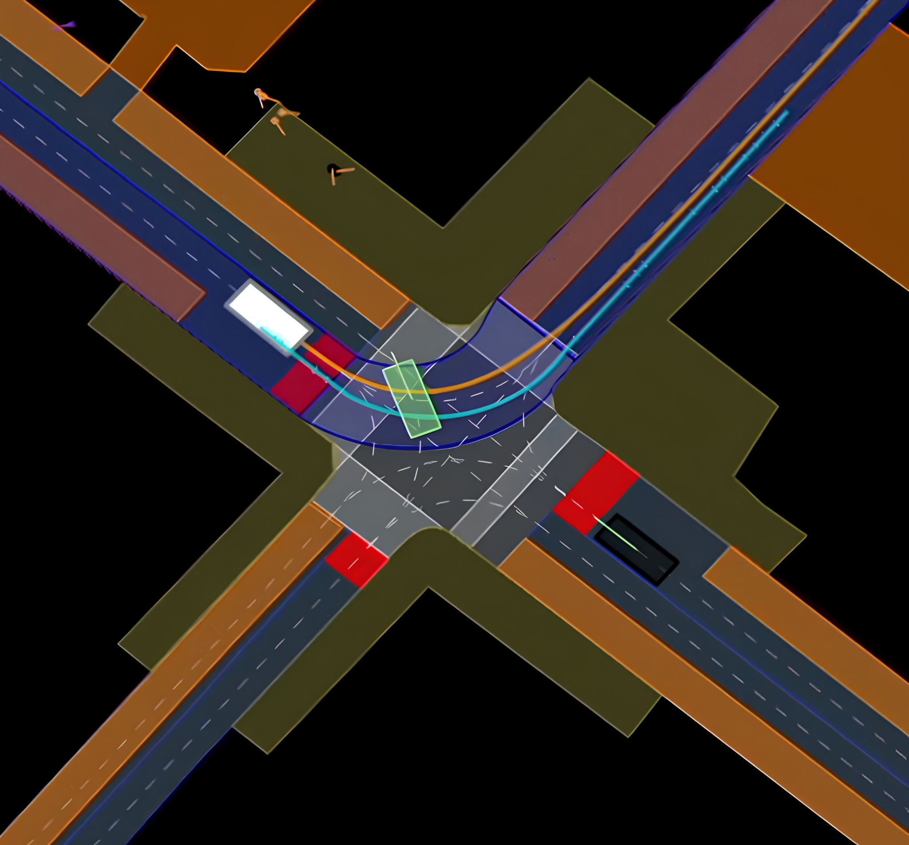
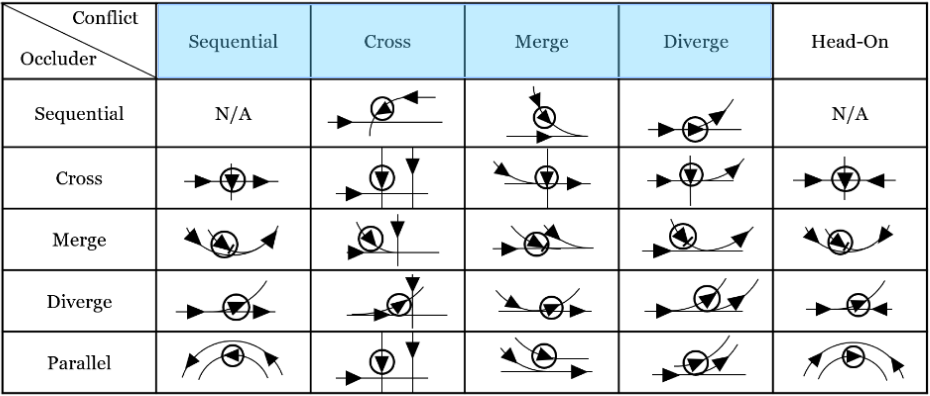

# OCC-Gen
**Systematic dynamic occlusion scenario generation.**

  <a href="https://uwaterloo.ca/waterloo-intelligent-systems-engineering-lab/projects/generating-occlusion-caused-collision-test-scenarios">Website</a> •
  <a href="https://uwspace.uwaterloo.ca/items/f62d32a5-140a-4348-abff-8a09c989bc68">Thesis</a>

  

## Contributions
OCC gen is an extension to the nuPlan simulator. The nuPlan simulator allows for the evaluation of autonomous driving planners against the variety of recorded scenarios. Our modifications allow the simulator to handle occlusions, and includes functionality for the automatic modification of scenarios for the purpose of generating critical dynamic occlusion scenarios.

## Features
* Testing of planners under occluion and with reaction time delays.
* Automatic dynamic occlusion scenario generation with four avaliable generators according to our dynamic occlusion typology.
* Ability to save and re-run generated scenarios under different conditions.
* Ability to run scenarios with other agents controlled by reactive planners.
* Visualization of scenarios and occlusion status via nuBoard.
* Metrics tracking via nuBoard (functionality inherited from nuplan).

  

## Installation Guide
* The up to date instructions for installing this modified version of the nuPlan devkit are found [here](occ_extra_docs/installation.md). (The setup guide follows the original nuPlan setup page found [here](https://nuplan-devkit.readthedocs.io/en/latest/installation.html).)
* Our work makes use of the tuPlan planner. It should be downloaded and installed side by side with the nuPlan devkit. Instructions on how to install it can be found [here](https://github.com/autonomousvision/tuplan_garage).

## Dataset Setup
* The links to the dataset setup and structure can be found [here](occ_extra_docs/dataset_setup.md).
* Original dataset structure is avaliable [here](https://github.com/motional/nuplan-devkit/blob/master/docs/dataset_setup.md) but may be outdated.

## How to Use
The `experiments/` folder contains a handfull of jupyter notebooks that allow one to explore the included generators.
* [bulk_running_experiments.ipynb](experiments/bulk_running_experiments.ipynb): This file is set up to folllow our dual filter technique to allow you to generate your own occlusion scenarios. You can explore the various labeled settings and step through the generation process. It will let you save the generated scenarios for optional re-runing later to the `npsc_files/` folder.
* [run_npsc_files.ipynb](experiments/run_npsc_files.ipynb): This file is set up to let you re-run a saved set of scenarios from the npsc files folder.
* [run_npsc_files_dual_regime_comparison.ipynb](experiments/run_npsc_files_dual_regime_comparison.ipynb): This file is set up to let you re-run a saved set of scenarios from the npsc files folder in multiple regimes so as to allow easy comparison in nuBoard.
* [result_visualization.ipynb](experiments/result_visualization.ipynb): This file is set up to visualize the differences between two runs in graphs.

## Making your own Modifier Classes
All modifier classes are stored in the `nuplan/planning/scenario_builder/scenario_modifier/` folder. To make your own, implement the two abstract classes found in [`abstract_scenario_modifier.py`](nuplan/planning/scenario_builder/scenario_modifier/abstract_scenario_modifier.py) in your own concrete classes.
* [`left_and_right_modifier.py`](nuplan/planning/scenario_builder/scenario_modifier/left_and_right_modifier) is a good simple example to follow. 
* [`sequential_conflict_with_occlusion_injection_modifier.py`](nuplan/planning/scenario_builder/scenario_modifier/sequential_conflict_with_occlusion_injection_modifier.py) is an up to date complex example to follow. 
Then modify the constructor in [`nuplan/planning/script/builders/scenario_modifier_builder.py`](`nuplan/planning/script/builders/scenario_modifier_builder.py`) to accept the new type of modifier. Then select it in the jupyter notebook in the appropriate section of the config.

## Modifying Occlusion
All occlusion classes are kept in the `nuplan/planning/simulation/occlusion/` folder. To make your own, implement abstract method in the [`abstract_occlusion_manager.py`](nuplan/planning/simulation/occlusion/abstract_occlusion_manager.py) file in your own concrete class.
* [range_occlusion_manager.py](nuplan/planning/simulation/occlusion/range_occlusion_manager.py) is a good simple example to follow. 
* [wedge_occlusion_manager.py](nuplan/planning/simulation/occlusion/wedge_occlusion_manager.py) is an up to date complex example to follow. 
Then modify the constructor in [`nuplan/planning/script/builders/occlusion_manager_builder.py`](`nuplan/planning/script/builders/occlusion_manager_builder.py`) to accept the new type of modifier. Then select it in the jupyter notebook in the appropriate section of the config.